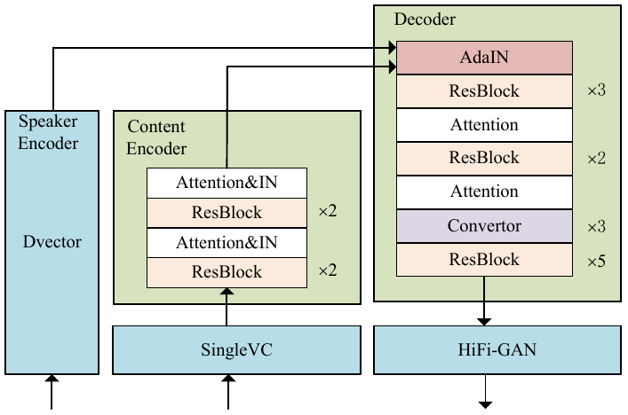

# MediumVC
MediumVC is an utterance-level method towards any-to-any VC. Before that, we propose [SingleVC](https://github.com/BrightGu/SingleVC) to perform A2O tasks(X<sub>i</sub> → Ŷ<sub>i</sub>) , X<sub>i</sub> means utterance i spoken by X). The Ŷ<sub>i</sub> are considered as SSIF. To build SingleVC, we employ a novel data augment strategy: pitch-shifted and duration-remained(PSDR) to produce paired asymmetrical training data. Then, based on pre-trained SingleVC, MediumVC performs an asymmetrical reconstruction task(Ŷ<sub>i</sub> → X̂<sub>i</sub>). Due to the asymmetrical reconstruction mode, MediumVC achieves more efficient feature decoupling and fusion. Experiments demonstrate MediumVC performs strong robustness for unseen speakers across multiple public datasets.
Here is the official implementation of the paper, [MediumVC](http://arxiv.org/abs/2110.02500).


The following are the overall model architecture.



For the audio samples, please refer to our [demo page](https://brightgu.github.io/MediumVC/). The more converted speeches can be found in "Demo/ConvertedSpeeches/".

### Envs
You can install the dependencies with
```bash
pip install -r requirements.txt
```

### Speaker Encoder
[Dvector](https://github.com/yistLin/dvector)  is a robust  speaker verification (SV) system pre-trained on [VoxCeleb1](https://www.robots.ox.ac.uk/~vgg/data/voxceleb/vox1.html)  using GE2E loss, and it  produces 256-dim speaker embedding. In our evaluation on multiple datasets(VCTK with 30000 pairs, Librispeech with 30000 pairs and VCC2020 with 10000 pairs), the equal error rates(EERs)and thresholds(THRs) are recorded in Table.

| Dataset | VCTK | LibriSpeech | VCC2020 |
| :------:| :------: | :------: |:------: |
| EER(%)/THR | 7.71/0.462 | 7.95/0.337 |1.06/0.432 |

### Vocoder
The [HiFi-GAN](https://github.com/jik876/hifi-gan) vocoder is employed to convert log mel-spectrograms to waveforms. The model is trained on universal datasets with 13.93M parameters. Through our evaluation, it can synthesize 22.05 kHz high-fidelity speeches over 4.0 MOS, even in cross-language or noisy environments.

### Infer
You can download the [pretrained model](https://drive.google.com/file/d/1mMSLYdHZZ9PtJo6kceMO2483TxKXgLa_/view?usp=sharing), and then edit "Any2Any/infer/infer_config.yaml".Test Samples could be organized  as "wav22050/$figure$/*.wav". 
```bash
python Any2Any/infer/infer.py
```
### Train from scratch

####  Preprocessing
The corpus should be organized as "VCTK22050/$figure$/*.wav", and then edit the config file "Any2Any/pre_feature/preprocess_config.yaml".The output "spk_emb_mel_label.pkl" will be used for training.
```bash
python Any2Any/pre_feature/figure_spkemb_mel.py
```
#### Training
Please edit the paths of pretrained  hifi-model,wav2mel,dvector,SingleVC in config file "Any2Any/config.yaml" at first.
```bash
python Any2Any/solver.py
```
